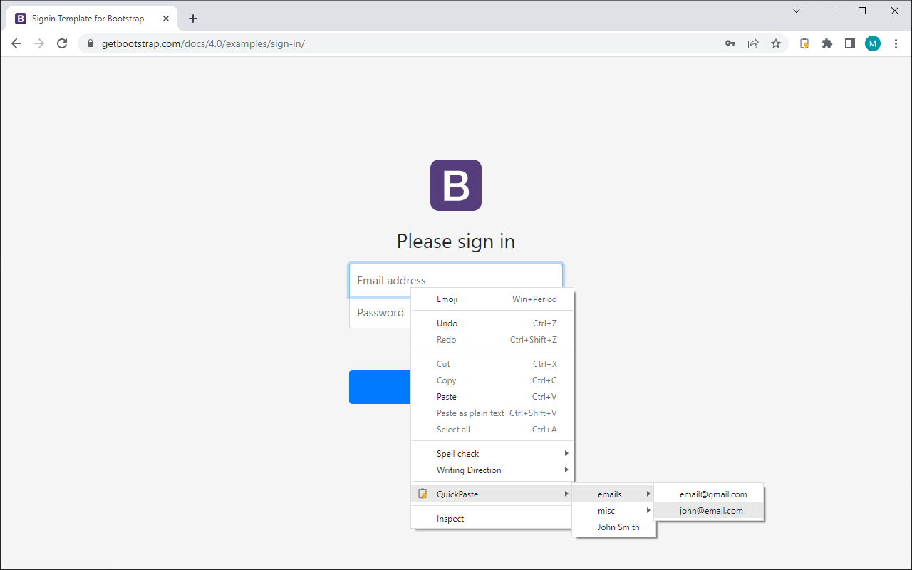

# QuickPaste  

QuickPaste lets users paste in custom content from the right-click context menu. Users can enter and manage their own content. QuickPaste also provides keyboard shortcuts to quickly paste content into the web page.

# https://chrome.google.com/webstore/detail/quickpaste/mnnjapbjgdjecngkkfjijehoeiiepcao

